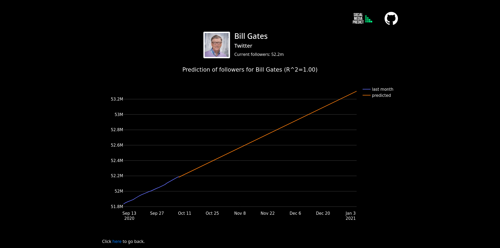
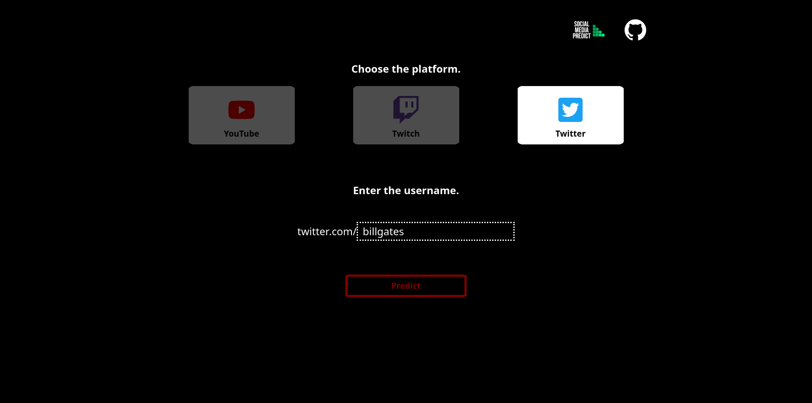
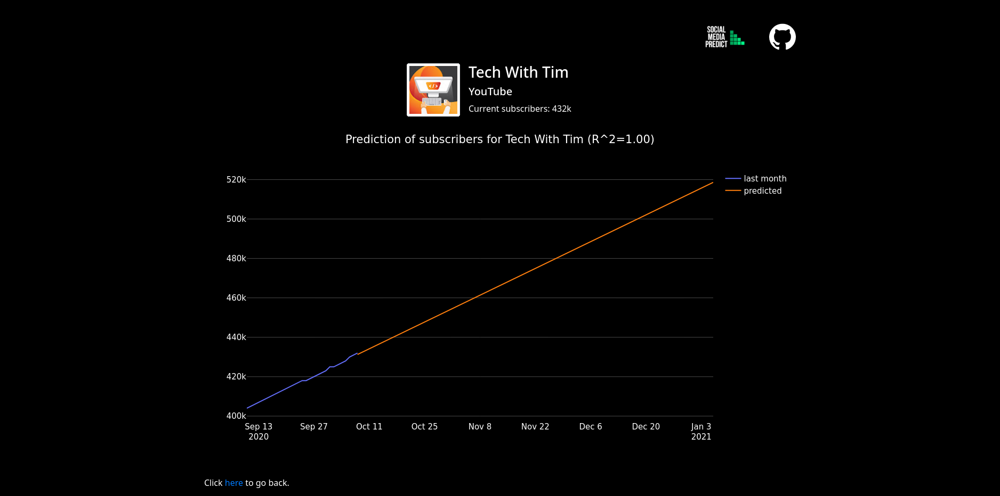
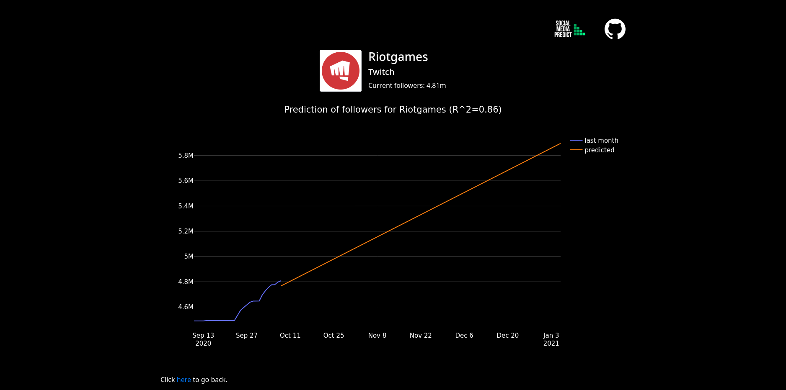

[](https://travis-ci.org/dzionek/social-media-predict)
[](undefined)
[](http://mypy-lang.org/)
[](https://lgtm.com/projects/g/dzionek/social-media-predict/context:javascript)
[](https://lgtm.com/projects/g/dzionek/social-media-predict/context:python)

# Social Media Predict

This web application uses Machine Learning to predict the future number of subscribers/followers of a YouTube, Twitch, or Twitter channel. Type the url of the channel and see an interactive chart containing statics of the channel in the last month and in the future.

<p align="center">
  <br>
  <b>Fig. 1</b> &nbsp Prediction of Twitter followers for Bill Gates.
</p>
<br/>

On the server side the app is powered by Python and Django. The frontend is built using React in TypeScript and SCSS styling, all bundled by Webpack.

## Usage
### Local development
You need to have Python package manager [pip](https://pypi.org/project/pip/) and JavaScript package manager [npm](https://nodejs.org/en/) from Node.JS.

You should optionally create a virtual environment for Python. Then, install the requirements.
```shell
pip install --upgrade pip
pip install -r requirements.txt
```

Currently the project doesn't make use of any database. You can still make database migrations, though.
```shell
python manage.py makemigrations
python manage.py migrate
```

Then go to the frontend directory and install JS dependencies.
```shell
cd frontend
npm install --save
```

Bundle TypeScript React code and SCSS files.
```shell
npm run dev  # use npm run dev:watch to watch for any changes
```

Finally, go back to the main directory and run the server. The app will be present at [*127.0.0.1:8000*](http://127.0.0.1:8000).
```shell
python manage.py runserver
```


### Production
Use [Docker](https://www.docker.com) to build the image from *Dockerfile* and then run the container on port 8000. The website will be available at *localhost:8000*.
```shell
docker build --tag predict .
docker run --publish 8000:8000 predict
```

## More screenshots
<p align="center">
  <br>
  <b>Fig. 2</b> &nbsp The panel to choose a platform and type a username.
</p>

<br><br>

<p align="center">
  <br>
  <b>Fig. 3</b> &nbsp Prediction of YouTube subscribers for Tech with Tim.
</p>

<br><br>

<p align="center">
  <br>
  <b>Fig. 4</b> &nbsp Prediction of Twitch followers for Riot Games.
</p>
